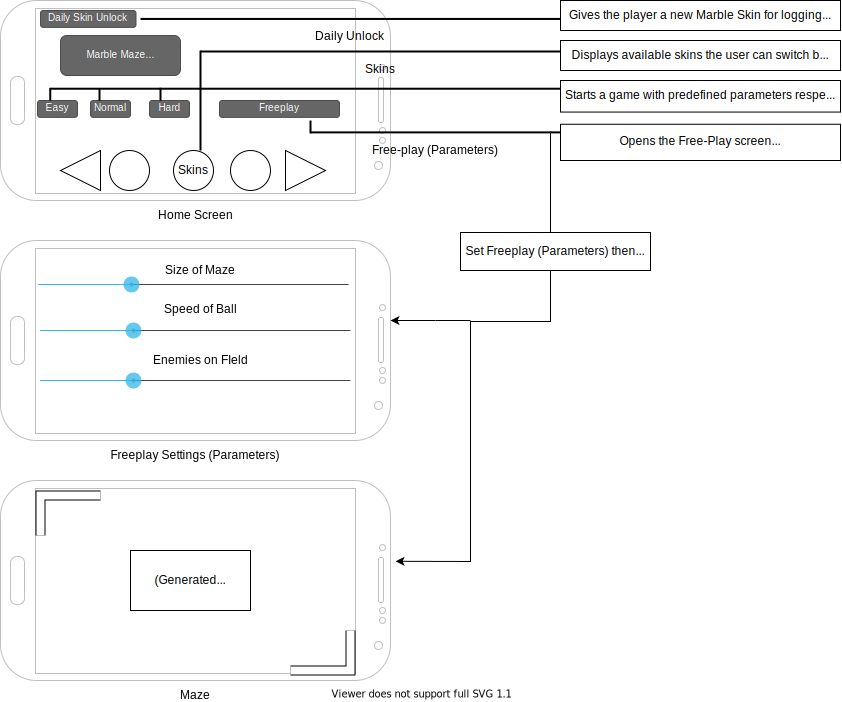
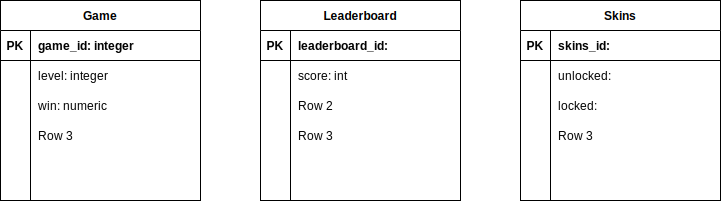

## Project Description

Marble maze is a game featuring tilt controls. Roll your Marble through increasingly challenging mazes. Choose your comfortable difficulty, or try creating your own with Freeplay mode. Roll fast for the high score spot, and play often for daily marbles!

## Intended Functionality

* Randomized Mazes-Every play will generate a new maze.

* Difficulties-Easy/Medium/Hard difficulties that generate mazes with varying sizes based on the predefined parameters.

* Freeplay mode-Allows the user to set their own maze parameters and create mazes as big or small as they like.

* Daily Marble Unlocks-Every 24 hours the user unlocks a new marble they can use. Drawn from a texture API.

## Intended users

* As a parent who wants to entertain my child, I want a safe entertaining app so that my child can safely enjoy her tablet.

* As a teacher who wants to entertain my class in modern ways, I want entertaining games so that I can preinstall them on school laptops.

* As a Childcare giver, I want an app that I can trust for my client's kids to use so that I can be sure they're not abusing their technology.

## Wireframe Diagram

## Entity-Relationship Diagram

## Device/external services

* Texture (Java 3D API)

URL: "https://docs.oracle.com/cd/E17802_01/j2se/javase/technologies/desktop/java3d/forDevelopers/J3D_1_3_API/j3dapi/javax/media/j3d/Texture.html"

My app will unlock a random texture for the player to use on their marble in reward for opening the app every 24 hours.

My app will have an on-device default texture and be able to function 24/7 without access to this service.